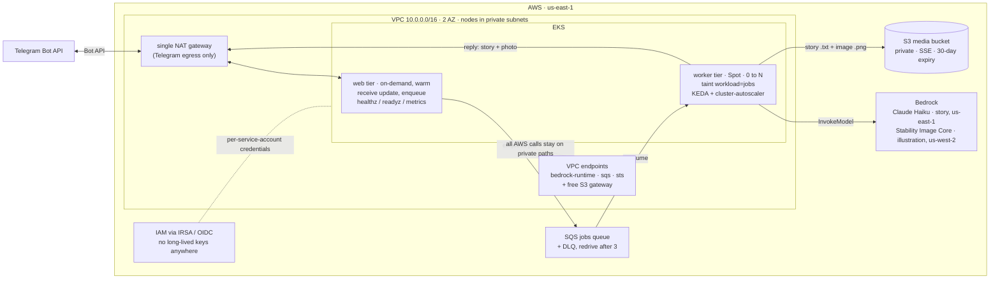

# AI Family Media Bot

A portfolio DevOps project: a Telegram bot that turns a family's request into a
short, age-appropriate **bedtime story** plus **one illustration**, designed to
run on **AWS (EKS + Bedrock)** — but built so the application runs **end-to-end
on a laptop with no AWS**.

This repo is split so the **infrastructure is built once** and the **brains swap
in later** without touching Terraform. The frozen interface between the two is
[`docs/api-contract.md`](docs/api-contract.md) — the source of truth.

> **Status:** working end-to-end against real AWS — a Telegram message in, a
> Bedrock-generated story + illustration back in ~15s, media persisted to S3
> (see **Local demo** below). Terraform is fully applied and converged
> (`terraform plan` clean). Next up: k8s manifests, KEDA scale-out
> verification, and CI — see [ROADMAP.md](ROADMAP.md).

---

## Architecture

Media generation is slow (seconds–minutes), so it can't run inside the webhook —
Telegram would time out. The webhook only **enqueues** and returns `200` fast; a
**worker** does the generation asynchronously.



Two independently-scaling tiers (per the contract):

- **web tier** — always warm: receives webhooks, enqueues, serves `/healthz`,
  `/readyz`, `/metrics`.
- **worker tier** — scales 0→N on queue depth: does the generation.

Everything AWS-shaped sits behind an interface, so the same app logic runs with
fakes locally and real services in prod:

| Concern  | Interface       | Dev impl (now)                | Prod impl (later)      |
|----------|-----------------|-------------------------------|------------------------|
| Queue    | `QueuePort`     | `InMemoryQueue`               | `SqsQueue`             |
| Story    | `StoryProvider` | `FakeStoryProvider` (canned)  | `BedrockStoryProvider` |
| Image    | `ImageProvider` | `FakeImageProvider` (PNG)     | `BedrockImageProvider` |
| Storage  | `StoragePort`   | `LocalDirStorage`             | `S3Storage`            |

Each is selected by an environment variable; both sides are real — the same
app logic runs with fakes on a laptop and against Bedrock/SQS/S3 in the demo.

### Design decisions

Every decision below is also documented in-line next to the code that makes it
(mostly in [`infra/`](infra/)); this is the short version.

| Decision | Why | Trade-off accepted |
|---|---|---|
| **IRSA everywhere, zero long-lived keys** | Pods exchange their service-account token via STS; each identity (app, KEDA, autoscaler) gets its own least-privilege role scoped to exactly the configured models, one queue, one bucket ([`infra/irsa.tf`](infra/irsa.tf)) | More IAM plumbing up front |
| **Single NAT gateway, not one per AZ** | The only traffic that needs internet egress is the Telegram Bot API; NATs cost ~$32/mo each | An AZ outage takes down Telegram egress — acceptable for this workload |
| **Only 3 interface VPC endpoints** (bedrock-runtime, sqs, sts) + free S3 gateway | Private paths only where traffic is constant or carries family content; cuts the fixed endpoint bill roughly in half (~$87 → ~$44/mo) | ECR pulls and logs ride the NAT — low-volume, non-sensitive |
| **Worker tier on Spot, 0→N, tainted** | Generation jobs are retryable by design (SQS redrive), the textbook Spot workload — ~70% cheaper compute; the `workload=jobs` taint stops system pods from pinning a node alive and blocking scale-to-zero | A job can be interrupted mid-run and retried |
| **Web tier on-demand, always warm** | A Spot interruption here means dropped Telegram updates | Pays on-demand price for one small node |
| **SQS between the tiers, DLQ after 3 attempts** | Generation takes seconds — too slow for a webhook response; poison messages get parked for inspection instead of looping and burning Bedrock money | Replies are async by design |
| **S3: 30-day expiry, no versioning** | Generated media is ephemeral and reproducible on demand — old versions are pure storage cost | Can't re-send a story older than 30 days |
| **Immutable ECR tags, keep last 10** | What runs in the cluster is always traceable to a commit; "latest drift" is impossible | Every build needs a fresh tag |
| **No real photos of children anywhere** | Characters are text descriptions / stylized avatars only — a hard product constraint, not a technical one | Less personalized illustrations |

### Endpoints

| Method | Path       | Purpose |
|--------|------------|---------|
| GET    | `/healthz` | Liveness. **Does not** touch Bedrock/SQS/S3. |
| GET    | `/readyz`  | Readiness — checks each swap-point dep; `503` if any is unready. |
| GET    | `/metrics` | Prometheus scrape (incl. per-job cost). |
| POST   | `/webhook` | Telegram update → validate → enqueue → `200`. |

### Bot commands

| Command          | Mode        | Meaning |
|------------------|-------------|---------|
| `/fairytale`     | `fairytale` | Guided scenario; assign family roles as text after the command. |
| `/custom <text>` | `custom`    | Free-text scene prompt. |
| `/surprise`      | `random`    | Random scenario. |

---

## Repo layout — `app/` vs `infra/`

```
app/             the Python service — runs locally with fakes, or against real AWS
infra/           Terraform (applied) — VPC, EKS, SQS, S3, ECR, IAM/IRSA
.github/workflows/   CI (next up)
observability/   dashboards / collector config (later)
docs/            the frozen API & job contract
```

The split is the whole point: `app/` only ever depends on the four interfaces,
so `infra/` can be built and changed independently. When the infra is ready you
flip env vars (`STORY_PROVIDER=bedrock`, `STORAGE=s3`, a real `QUEUE`, …) and the
app logic is untouched.

`app/` internals:

```
family_media_bot/
  app.py          FastAPI app + endpoints + lifespan (starts the worker)
  worker.py       background queue consumer
  pipeline.py     per-job flow: story → image prompt → image → store → send
  factory.py      composition root — picks an adapter per port from env
  config.py       env-driven settings        models.py    frozen Job shape
  prompts.py      prompt composition + bedtime guardrails
  commands.py     Telegram update → command   telegram.py  Bot API client
  logging_setup.py  structured JSON logs      telemetry.py  OpenTelemetry (OTLP)
  metrics.py      Prometheus metrics
  ports/          QueuePort, StoryProvider, ImageProvider, StoragePort
  adapters/       *_fake / *_inmemory / *_localdir (dev) + *_bedrock / *_s3 (stubs)
```

---

## Run it locally (no AWS, no Telegram token)

Requires Python 3.11+.

```bash
cp .env.example .env          # defaults already select fake/in-memory/local

make install                  # creates app/.venv and installs deps
make run                      # serves on http://localhost:8080
```

In another shell, exercise the full flow:

```bash
make smoke
# or manually:
curl localhost:8080/healthz
curl -X POST localhost:8080/webhook \
  -H 'content-type: application/json' \
  -d @docs/sample-update.json
```

Then watch the server logs for `job enqueued` → `job started` → `stored media
locally` → `job completed`, and find the generated PNG at
`app/var/media/generated/<job_id>.png`. With no Telegram token set, the send step
logs `telegram disabled — would send story+image` instead of calling the Bot API.

Scrape metrics (including per-job cost) at `http://localhost:8080/metrics`.

### Run in Docker

```bash
make docker-build
make docker-run               # maps :8080, reads ./.env
```

---

## Local demo (real Telegram + Bedrock + SQS + S3)

One process runs everything: a Telegram **long-polling** listener (no webhook
needed), the SQS-backed queue, and the worker that calls Bedrock and S3.

**Prerequisites**

- `make install` done (Python 3.11+, creates `app/.venv`).
- AWS credentials for account `684049557114` in your default profile / env vars
  (Bedrock, SQS, and S3 access). The infra (queue + bucket) is already applied.
- A Telegram bot token from [@BotFather](https://t.me/BotFather).

**Configure** — create `app/.env` (gitignored) with the demo values:

```bash
QUEUE=sqs
SQS_QUEUE_URL=https://sqs.us-east-1.amazonaws.com/684049557114/ai-family-media-bot-jobs
STORY_PROVIDER=bedrock
IMAGE_PROVIDER=bedrock
STORAGE=s3
S3_BUCKET=ai-family-media-bot-media-684049557114
AWS_REGION=us-east-1
BEDROCK_TEXT_MODEL_ID=us.anthropic.claude-haiku-4-5-20251001-v1:0
BEDROCK_IMAGE_MODEL_ID=stability.stable-image-core-v1:1
BEDROCK_IMAGE_REGION=us-west-2
TELEGRAM_BOT_TOKEN=<your token>
TELEGRAM_POLLING=true
LOG_FORMAT=console
```

**Run**

```bash
make demo
```

Message the bot (e.g. «история про дракона и маяк») — within ~30–60s it replies
with a short Russian bedtime story and a matching illustration. Both are also
saved to `s3://<bucket>/generated/<job_id>.txt|.png`. The logs narrate every
step: `message received → job enqueued → job started → story done → image done
→ saved → replied → job completed`.

Notes: run only **one** polling instance per bot token (Telegram returns 409
otherwise). If the image model fails, the bot falls back to a placeholder image
rather than dropping the reply; on a hard failure it apologizes in the chat.

---

## Configuration

Every setting is an environment variable with a safe local default — see
[`.env.example`](.env.example) for the annotated list. The ones you'll touch
most:

- `STORY_PROVIDER` / `IMAGE_PROVIDER` — `fake` (default) or `bedrock` (stub).
- `STORAGE` — `local` (default) or `s3` (stub). `QUEUE` — `inmemory` (default).
- `RUN_MODE` — `all` (default; web + in-process worker), or `web` / `worker` for
  the prod tier split (which uses SQS as the shared queue).
- `TELEGRAM_BOT_TOKEN` — leave blank to log sends instead of calling Telegram.
- `OTEL_EXPORTER_OTLP_ENDPOINT` — set to export traces; unset = safe no-op.

## Infrastructure

Terraform for the AWS environment lives in [`infra/`](infra/): a single root
module (one state file, no dev/prod split) with one `.tf` file per concern —
2-AZ VPC with a single NAT gateway, VPC endpoints so sensitive and constant
AWS traffic (Bedrock, SQS, S3, STS) never leaves the AWS backbone (ECR pulls
and logs deliberately ride the NAT — a documented FinOps trade-off), EKS with
a warm on-demand `web`
node group and a Spot `workers` group scaling 0→N, SQS jobs queue + DLQ, a
private 30-day-expiry media bucket, ECR, and least-privilege IRSA roles (app,
KEDA, cluster-autoscaler). Community modules cover VPC/EKS boilerplate;
everything carrying a design decision is raw resources. Staged apply order:
**bootstrap** (state bucket, by hand) → **network** (VPC +
endpoints) → **data plane** (SQS/S3/ECR) → **eks** → **irsa** — full commands
in [`infra/README.md`](infra/README.md).

## Observability

- **Logs** — structured JSON on stdout from the start, enriched with `extra`
  fields and OTel `trace_id`/`span_id` when a trace is active.
- **Metrics** — Prometheus at `/metrics`, including `fmb_job_cost_usd` (the
  contract's per-job FinOps metric: text call + image call), job duration,
  enqueued/processed counts, and queue depth.
- **Traces** — OpenTelemetry SDK with an OTLP/HTTP exporter; the per-job pipeline
  runs inside a `job.process` span. No-op when no endpoint is configured.
