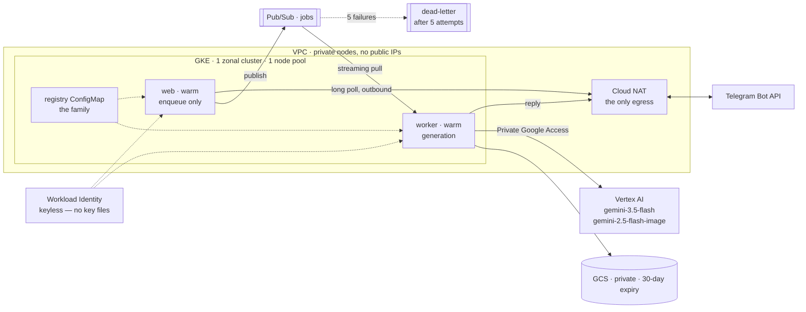
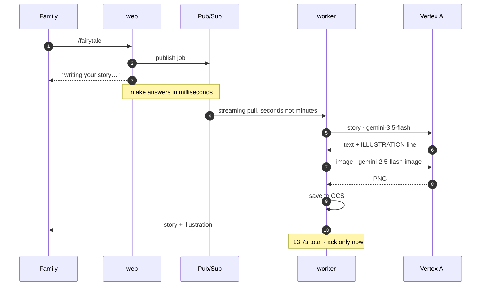

# AI Family Media Bot

A Telegram bot that turns a family's request into a short, age-appropriate
**bedtime story** plus **one illustration** — starring the family's own
characters, in English, Russian, or Hebrew.

Runs on **GCP (GKE + Vertex AI)**, and end-to-end on a laptop with no cloud
account. Cloud services sit behind ports and adapters; the frozen contract is
[`docs/api-contract.md`](docs/api-contract.md).

---

## Architecture

Generation takes ~14 seconds, so it cannot run inline with Telegram intake. Both
entry points — long polling and `/webhook` — only **enqueue**; a worker generates.



Nothing reaches in. The bot polls Telegram **outbound** through Cloud NAT, which
is why there is no ingress, no load balancer, and no public endpoint. Traffic to
Vertex AI, GCS, and Pub/Sub never leaves Google's network at all.

One job, end to end:



Every cloud integration sits behind an interface, selected by environment
variable and validated at startup:

| Concern | Interface | Local | GCP |
|---|---|---|---|
| Queue | `QueuePort` | `InMemoryQueue` | `PubSubQueue` |
| Story | `StoryProvider` | `FakeStoryProvider` | `VertexStoryProvider` |
| Image | `ImageProvider` | `FakeImageProvider` | `VertexImageProvider` |
| Storage | `StoragePort` | `LocalDirStorage` | `GcsStorage` |

### Design decisions

| Decision | Why | Trade-off |
|---|---|---|
| **Two warm tiers, not scale-to-zero** | Activating a worker from zero on Pub/Sub backlog measured **4m43s** — the backlog metric samples on a ~60s interval and can gap for minutes. On a bot a child waits for, that latency *is* the product | An idle worker costs ~₪90/month |
| **Keyless workload identity** | Pods exchange a Kubernetes token for Google credentials. No service-account key file exists in this project | More IAM plumbing up front |
| **Character registry in git, in English** | Image models are trained overwhelmingly on English captions, so an English appearance string is more *repeatable* — which is what keeps the same child recognisable across illustrations | Characters are edited by pull request, not from chat |
| **Adapters never fabricate success** | A placeholder image, a truncated story, or a `$0` cost is a failure disguised as success: it acks, logs `job completed`, and nobody notices. Adapters raise; the queue retries | A transient error costs a retry instead of returning something |
| **Everything time-bounded** | 40s per model call, 90s per job, 60s Pub/Sub lease. A hung call would otherwise block the only worker indefinitely | A slow-but-valid generation can be cut off |
| **Image tag supplied at deploy, never committed** | A release always traces to a commit and cannot drift from what is running | Every release needs a fresh tag |
| **No real photos of children** | Characters are text descriptions only | Illustrations are less personalised by design |

---

## Bot commands

| Command | Meaning |
|---|---|
| `/fairytale [extra wishes]` | A story starring the family's registered characters |
| `/custom <text>` | Free-text scene — or just type the text with no command |
| `/surprise` | A random story, no questions asked |
| `/family` | Lists who stars in the stories (names only) |
| `/start` | How to use the bot |

**Language** is a message prefix, not a command: `lang:en`, `lang:ru`, `lang:he`.
For example `lang:en /fairytale`. Without it the bot uses your Telegram client's
language, falling back to Russian. The choice is deliberately not remembered —
that would mean per-chat state.

Only `/fairytale` uses the cast. `/custom` and `/surprise` produce
characterless stories.

## HTTP endpoints

| Path | Purpose |
|---|---|
| `GET /healthz` | Liveness. Makes **no** cloud call — an outage must not cause a restart loop |
| `GET /livez` | Worker liveness: is this process actually attached to the queue? The stream can die while the pod stays Ready |
| `GET /readyz` | Readiness — checks the configured dependencies. `503` if any is unready |
| `GET /metrics` | Prometheus scrape |
| `POST /webhook` | Telegram update → validate → enqueue → `200` |

---

## Repo layout

```
app/                     the Python service
  family_media_bot/
    app.py               FastAPI app, endpoints, lifespan
    dispatch.py          the one update handler, shared by webhook and poller
    worker.py            queue consumer with a drain window
    pipeline.py          story → image prompt → image → store → send
    characters.py        the cast: schema, loader, validation
    prompts.py           per-language system prompts + prompt composition
    i18n.py              what the bot says in chat (en/ru/he)
    commands.py          parsing — pure, no I/O
    factory.py           composition root: one adapter per port
    config.py            env settings      models.py  frozen Job shape
    ports/               QueuePort, StoryProvider, ImageProvider, StoragePort
    adapters/            local fakes and GCP implementations
  tests/                 unittest suites
deploy/charts/           the Helm chart
  .../files/characters.yaml   the family, mounted as a ConfigMap
deploy/values/prod.yaml  deployment inputs (no image tag — CI supplies it)
infra/gcp/               Terraform: VPC, GKE, Pub/Sub, GCS, Artifact Registry, IAM
docs/                    contract, runbook, design notes
```

---

## Run it locally (no cloud account, no Telegram token)

Requires Python 3.11+.

```bash
cp .env.example .env
make install
make run        # http://localhost:8080, fake providers, the real cast
```

In another shell, `make smoke` exercises the full flow. Watch for `job enqueued`
→ `story done` → `image done` → `saved` → `job completed`, and find the PNG at
`app/var/media/generated/<job_id>.png`. With no token set, the send step logs
`telegram disabled — would send story+image`.

Other targets: `make test`, `make lint`, `make fmt`, `make helm-lint`,
`make docker-build`.

### Against real GCP

Put your `GCP_PROJECT_ID`, `GCS_BUCKET`, and `TELEGRAM_BOT_TOKEN` in `app/.env`,
set the providers to `vertex`/`gcs`, and authenticate with
`gcloud auth application-default login`. Then `make demo`.

Keep `QUEUE=inmemory` for this: one process both receives and generates, so it
never competes with the deployed worker for the same Pub/Sub messages. Run only
**one** poller per bot token — Telegram returns 409 otherwise.

---

## Deployment

```bash
helm upgrade --install family-media-bot deploy/charts/family-media-bot \
  --namespace app -f deploy/values/prod.yaml \
  --set-string image.tag='<git-sha>' --rollback-on-failure --wait --timeout 5m
```

`--rollback-on-failure` is Helm 4's replacement for `--atomic`. Editing
`files/characters.yaml` and upgrading rolls both tiers via a checksum annotation
— no image rebuild. Operational detail is in the [runbook](docs/runbook.md).

Terraform owns the cloud resources; Helm owns the Kubernetes objects. The
Telegram token is created imperatively as a Secret, so its value never enters a
values file or the Helm release.

Running cost is roughly **₪220–280/month**, dominated by the single always-on
node. The GKE control plane is free for one zonal cluster.

## Configuration

Every setting is an environment variable with a safe local default — see
[`.env.example`](.env.example). The ones you'll touch:

- `STORY_PROVIDER` / `IMAGE_PROVIDER` — `fake` or `vertex`
- `STORAGE` — `local` or `gcs`; `QUEUE` — `inmemory` or `pubsub`
- `RUN_MODE` — `all` (web + in-process worker), or `web` / `worker` for the split
- `CHARACTERS_FILE` — path to the cast; `CHARACTERS_REQUIRED=true` makes an
  absent registry fatal at startup rather than telling stories about nobody
- `TELEGRAM_BOT_TOKEN` — blank logs sends instead of calling Telegram
- `OTEL_EXPORTER_OTLP_ENDPOINT` — unset is a safe no-op

## Observability

- **Logs** — structured JSON, with OTel `trace_id`/`span_id` when a trace is
  active. No personal data: no `chat_id`, no message text, no character names.
- **Metrics** — Prometheus at `/metrics`: `fmb_jobs_processed_total`,
  `fmb_job_processing_seconds`, `fmb_queue_wait_seconds`, `fmb_job_cost_usd`
  (text + image, including reasoning tokens, which are billed but excluded from
  the visible output count), `fmb_illustration_hint_missing`.
- **Traces** — OTLP/HTTP exporter; each job runs inside a `job.process` span.

> **Not yet collected.** Nothing scrapes `/metrics` in the cluster — there is no
> `PodMonitoring` and only system-component monitoring is enabled. So
> `fmb_queue_wait_seconds` measured the 4m43s cold start from day one and nobody
> could see it. `fmb_queue_depth` is worse than missing: Pub/Sub exposes backlog
> through Cloud Monitoring, not the subscriber API, so it always reports `0`.
> Both are tracked in [ROADMAP.md](ROADMAP.md).
