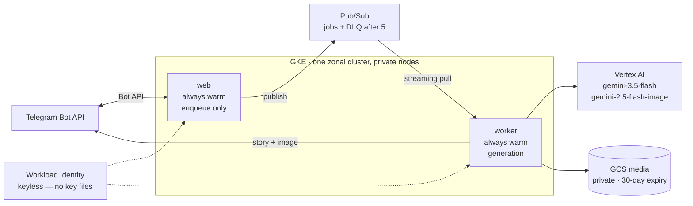

# AI Family Media Bot

A portfolio DevOps project: a Telegram bot that turns a family's request into a
short, age-appropriate **bedtime story** plus **one illustration**, running on
**GCP (GKE + Vertex AI)** — and end-to-end on a laptop with no cloud account.

Cloud services stay behind ports and adapters, so the same pipeline runs against
local fakes or real GCP. The frozen application contract is
[`docs/api-contract.md`](docs/api-contract.md).

---

## Architecture

Media generation is slow (seconds–minutes), so it cannot run inline with
Telegram intake. Whether an update arrives through long polling or `/webhook`,
the web tier only **enqueues** it; a **worker** performs generation
asynchronously.



Two tiers, separated because their failure and latency profiles differ: intake
must answer Telegram in milliseconds, generation takes ~14 seconds.

- **web tier** — receives Telegram updates, enqueues, serves `/healthz`,
  `/readyz`, `/metrics`.
- **worker tier** — consumes the subscription and runs the pipeline.

Every cloud integration sits behind an interface, so the same application logic
runs with local fakes or against real services:

| Concern | Interface | Local | GCP |
|---|---|---|---|
| Queue | `QueuePort` | `InMemoryQueue` | `PubSubQueue` |
| Story | `StoryProvider` | `FakeStoryProvider` | `VertexStoryProvider` |
| Image | `ImageProvider` | `FakeImageProvider` | `VertexImageProvider` |
| Storage | `StoragePort` | `LocalDirStorage` | `GcsStorage` |

Adapters are selected by environment variable, validated at startup — an
unrecognised value fails fast rather than being ignored.

### Design decisions

| Decision | Why | Trade-off accepted |
|---|---|---|
| **Ports and adapters for cloud services** | Queue, story, image, and storage implementations change without touching the pipeline | More interfaces to maintain |
| **Keyless workload identity** | Pods exchange a Kubernetes service-account token for Google credentials. No service-account key file exists anywhere in this project | More IAM plumbing up front |
| **Two warm tiers, not scale-to-zero** | Activating a worker from zero on Pub/Sub backlog measured **4m43s**: the backlog metric samples on a ~60s interval and can gap for minutes. On a bot a child is waiting for, that latency *is* the product | An idle worker costs ~₪90/month |
| **One Pub/Sub stream per worker process** | Streaming pull with outstanding messages capped at worker concurrency; callbacks hand off to asyncio and ack only after the pipeline succeeds | The adapter is more intricate than a unary pull |
| **Adapters never fabricate success** | A placeholder image, a truncated story, or a `$0` cost is a failure disguised as a success — it acks, logs `job completed`, and nobody notices. Adapters raise and let the queue retry | A transient provider error costs a retry instead of returning something |
| **Character registry in English, in git** | Image models are trained overwhelmingly on English captions, so an English appearance string is both better and more *repeatable* than a translated one | Characters are edited by pull request, not from chat |
| **Private storage with expiry** | Generated media is private and reproducible, so it expires automatically | Old stories cannot be re-sent indefinitely |
| **Immutable deployment tags** | The image tag is supplied by CI, never committed, so a release always traces to a commit | Every release needs a fresh tag |
| **No real photos of children** | Characters are text descriptions only | Illustrations are intentionally less personalised |

### Endpoints

| Method | Path       | Purpose |
|--------|------------|---------|
| GET    | `/healthz` | Liveness. **Does not** call cloud providers — a cloud outage must not trigger a restart loop. |
| GET    | `/readyz`  | Readiness — checks each swap-point dep; `503` if any is unready. |
| GET    | `/metrics` | Prometheus scrape (incl. per-job cost). |
| POST   | `/webhook` | Telegram update → validate → enqueue → `200`. |

### Bot commands

| Command          | Mode        | Meaning |
|------------------|-------------|---------|
| `/fairytale`     | `fairytale` | A tale starring the family's registered characters. |
| `/custom <text>` | `custom`    | Free-text scene prompt. |
| `/surprise`      | `random`    | Random scenario. |

---

## Repo layout

```
app/             the Python service — local and GCP adapters
deploy/charts/   the Helm application chart
deploy/values/   deployment inputs (prod.yaml)
infra/gcp/       Terraform — VPC, GKE, Pub/Sub, GCS, Artifact Registry, Workload Identity
docs/            the frozen API & job contract, design notes, runbook
observability/   placeholder for planned dashboards and collector config
```

`app/` internals:

```
family_media_bot/
  app.py          FastAPI app + endpoints + lifespan (starts the worker)
  worker.py       background queue consumer
  pipeline.py     per-job flow: story → image prompt → image → store → send
  factory.py      composition root — picks an adapter per port from env
  config.py       env-driven settings        models.py    frozen Job shape
  prompts.py      prompt composition + bedtime guardrails
  commands.py     Telegram update → command   telegram.py  Bot API client
  logging_setup.py  structured JSON logs      telemetry.py  OpenTelemetry (OTLP)
  metrics.py      Prometheus metrics
  ports/          QueuePort, StoryProvider, ImageProvider, StoragePort
  adapters/       local and GCP implementations
```

---

## Run it locally (no cloud account, no Telegram token)

Requires Python 3.11+.

```bash
cp .env.example .env          # defaults already select fake/in-memory/local

make install                  # creates app/.venv and installs deps
make run                      # serves on http://localhost:8080
```

In another shell, exercise the full flow:

```bash
make smoke
```

Then watch the server logs for `job enqueued` → `job started` → `story done` →
`image done` → `saved` → `job completed`, and find the generated PNG at
`app/var/media/generated/<job_id>.png`. With no Telegram token set, the send step
logs `telegram disabled — would send story+image` instead of calling the Bot API.

Scrape metrics (including per-job cost) at `http://localhost:8080/metrics`.

### Local demo against real GCP

Create `app/.env` (gitignored) with `STORY_PROVIDER=vertex`,
`IMAGE_PROVIDER=vertex`, `STORAGE=gcs`, your `GCP_PROJECT_ID`, `GCS_BUCKET`, and
a `TELEGRAM_BOT_TOKEN` from [@BotFather](https://t.me/BotFather). Credentials come
from `gcloud auth application-default login`.

```bash
make demo
```

Keep `QUEUE=inmemory` for this: `RUN_MODE=all` means one process both receives
and generates, so it never competes with the deployed worker for the same
Pub/Sub messages. Run only **one** polling instance per bot token — Telegram
returns 409 otherwise.

### Run in Docker

```bash
make docker-build
make docker-run               # maps :8080, reads ./.env
```

---

## Deployment

The live release is installed on GKE from the Helm chart with
[`deploy/values/prod.yaml`](deploy/values/prod.yaml):

- both tiers stay warm; the web tier polls Telegram;
- Pub/Sub carries generation jobs, with a DLQ after 5 delivery attempts;
- Vertex AI uses `gemini-3.5-flash` for stories and `gemini-2.5-flash-image` for
  illustrations;
- GCS stores private generated media;
- GKE Workload Identity supplies keyless access to Google Cloud APIs.

The image tag is supplied at upgrade time rather than committed, so a release is
always traceable to a commit. Operational commands are in the
[runbook](docs/runbook.md).

## Configuration

Every setting is an environment variable with a safe local default — see
[`.env.example`](.env.example) for the annotated list. The ones you'll touch
most:

- `STORY_PROVIDER` / `IMAGE_PROVIDER` — `fake` or `vertex`.
- `STORAGE` — `local` or `gcs`; `QUEUE` — `inmemory` or `pubsub`.
- `RUN_MODE` — `all` (default; web + in-process worker), or `web` / `worker` for
  the prod tier split, which uses Pub/Sub as the shared queue.
- `TELEGRAM_BOT_TOKEN` — leave blank to log sends instead of calling Telegram.
- `OTEL_EXPORTER_OTLP_ENDPOINT` — set to export traces; unset = safe no-op.

## Infrastructure

[`infra/gcp/`](infra/gcp/) is the single Terraform root: a custom VPC with
private nodes and Cloud NAT, a zonal GKE cluster, Pub/Sub jobs queue and DLQ, a
private GCS media bucket with lifecycle expiry, Artifact Registry, and
least-privilege service accounts bound through Workload Identity.

Terraform owns cloud resources; it does not own Kubernetes workloads. The
[Helm chart](deploy/charts/family-media-bot/) owns the web and worker
Deployments, configuration, and service account. `make helm-lint` renders and
schema-validates the release.

## Observability

- **Logs** — structured JSON on stdout, enriched with `extra` fields and OTel
  `trace_id`/`span_id` when a trace is active. No personal data: no `chat_id`, no
  message text, no character names.
- **Metrics** — Prometheus at `/metrics`, including `fmb_job_cost_usd` (the
  contract's per-job FinOps metric — text call plus image call, counting
  reasoning tokens, which are billed but excluded from the visible output count),
  job duration, queue wait, and enqueued/processed counts.
- **Traces** — OpenTelemetry SDK with an OTLP/HTTP exporter; the per-job pipeline
  runs inside a `job.process` span. No-op when no endpoint is configured.
