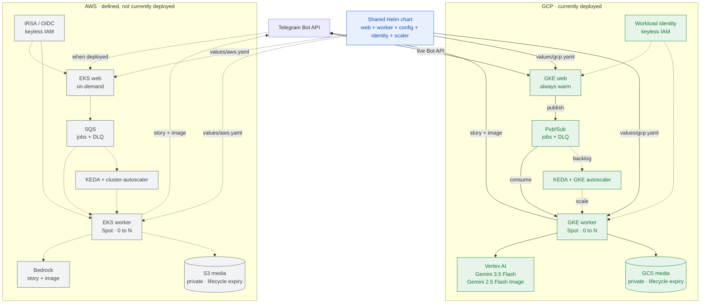

# AI Family Media Bot

A portfolio DevOps project: a Telegram bot that turns a family's request into a
short, age-appropriate **bedtime story** plus **one illustration**. The
application supports **AWS (EKS + Bedrock)** and **GCP (GKE + Vertex AI)** and
also runs end-to-end on a laptop with no cloud account.

The business workflow and Kubernetes workload are shared. Cloud services stay
behind ports and adapters, each cloud has an independent Terraform root, and
one Helm chart renders either provider-specific deployment. The frozen
application contract is [`docs/api-contract.md`](docs/api-contract.md).

> **Current state:** infrastructure is defined for AWS and GCP, but the
> application is currently deployed only on GCP. The live path uses GKE,
> Pub/Sub, GCS, Vertex AI, Workload Identity, KEDA, and the shared Helm chart.
> AWS remains a supported deployment target and is not currently running. See
> the [GCP runbook](docs/gcp-interview-runbook.md) and
> [roadmap](ROADMAP.md).

---

## Architecture

Media generation is slow (seconds–minutes), so it cannot run inline with
Telegram intake. Whether an update arrives through live long polling or
`/webhook`, the web tier only **enqueues** it; a **worker** performs generation
asynchronously.



Solid paths are the live GCP deployment. Dashed AWS paths show the equivalent
deployment the same chart renders when AWS infrastructure is selected.

Two independently-scaling tiers (per the contract):

- **web tier** — always warm: receives Telegram updates, enqueues, and serves
  `/healthz`, `/readyz`, `/metrics`.
- **worker tier** — scales 0→N on queue depth: does the generation.

Every cloud integration sits behind an interface, so the same application logic
runs with local fakes or either provider:

| Concern | Interface | Local | AWS | GCP |
|---|---|---|---|---|
| Queue | `QueuePort` | `InMemoryQueue` | `SqsQueue` | `PubSubQueue` |
| Story | `StoryProvider` | `FakeStoryProvider` | `BedrockStoryProvider` | `VertexStoryProvider` |
| Image | `ImageProvider` | `FakeImageProvider` | `BedrockImageProvider` | `VertexImageProvider` |
| Storage | `StoragePort` | `LocalDirStorage` | `S3Storage` | `GcsStorage` |

Each adapter is selected by environment variables. GCP is the active production
configuration; AWS adapters and Helm values remain maintained and render-tested.

### Design decisions

Every decision below is documented close to its implementation in
[`app/`](app/), [`infra/`](infra/), or [`deploy/`](deploy/); this is the short
version.

| Decision | Why | Trade-off accepted |
|---|---|---|
| **Independent Terraform roots** | [`infra/aws/`](infra/aws/) and [`infra/gcp/`](infra/gcp/) have separate providers, backends, and state, so changing one cloud cannot rewrite the other | Shared concepts are expressed twice at the infrastructure layer |
| **One shared application chart** | [`deploy/charts/family-media-bot/`](deploy/charts/family-media-bot/) owns the common web/worker workload; cloud values branch only for identity, environment, and scaler details | The values schema must validate both providers |
| **Ports and adapters for cloud services** | Queue, story, image, and storage implementations can change without changing the pipeline | More interfaces and provider tests |
| **Keyless workload identity** | GCP uses Workload Identity; AWS uses IRSA/OIDC. Neither deployment needs a service-account key or static cloud credential | More IAM plumbing up front |
| **Warm web, event-scaled worker** | Telegram intake stays responsive while generation workers scale from zero against Pub/Sub or SQS backlog | Replies are asynchronous |
| **Spot worker capacity** | Generation jobs are retryable and acknowledged only after processing, making them suitable for interruptible nodes | Interrupted work may be retried |
| **One Pub/Sub stream per worker process** | The GCP adapter uses streaming pull with outstanding messages capped at worker concurrency; callbacks hand off to asyncio and ack/nack only after processing | Streaming removes per-dequeue unary pull churn but does not remove KEDA/Cloud Monitoring cold-start latency |
| **Provider-native private storage with expiry** | GCS or S3 keeps generated media private and removes reproducible artifacts automatically | Old stories cannot be re-sent indefinitely |
| **Immutable deployment tags** | Artifact Registry or ECR images remain traceable to a specific rollout | Every release needs a fresh tag |
| **No real photos of children** | Characters are text descriptions or stylized avatars only | Illustrations are intentionally less personalized |

### Endpoints

| Method | Path       | Purpose |
|--------|------------|---------|
| GET    | `/healthz` | Liveness. **Does not** call cloud providers. |
| GET    | `/readyz`  | Readiness — checks each swap-point dep; `503` if any is unready. |
| GET    | `/metrics` | Prometheus scrape (incl. per-job cost). |
| POST   | `/webhook` | Telegram update → validate → enqueue → `200`. |

### Bot commands

| Command          | Mode        | Meaning |
|------------------|-------------|---------|
| `/fairytale`     | `fairytale` | Guided scenario; assign family roles as text after the command. |
| `/custom <text>` | `custom`    | Free-text scene prompt. |
| `/surprise`      | `random`    | Random scenario. |

---

## Repo layout

```
app/             the Python service — local, AWS, and GCP adapters
deploy/charts/   shared AWS/GCP Helm application chart
deploy/values/   provider-specific application values
deploy/addons/   provider-specific KEDA/autoscaler Helm values
deploy/legacy/   historical manifests, not a production deployment path
infra/aws/       AWS Terraform — VPC, EKS, SQS, S3, ECR, IAM/IRSA
infra/gcp/       GCP Terraform — VPC, GKE, Pub/Sub, GCS, Artifact Registry, Workload Identity
.github/workflows/   placeholder for planned CI
observability/   placeholder for planned dashboards and collector config
docs/            the frozen API & job contract
```

The split is the whole point: `app/` depends on four interfaces, each Terraform
root owns one cloud, and the shared Helm chart injects the selected provider
configuration. Switching clouds changes adapters, values, and identity—not the
story pipeline.

`app/` internals:

```
family_media_bot/
  app.py          FastAPI app + endpoints + lifespan (starts the worker)
  worker.py       background queue consumer
  pipeline.py     per-job flow: story → image prompt → image → store → send
  factory.py      composition root — picks an adapter per port from env
  config.py       env-driven settings        models.py    frozen Job shape
  prompts.py      prompt composition + bedtime guardrails
  commands.py     Telegram update → command   telegram.py  Bot API client
  logging_setup.py  structured JSON logs      telemetry.py  OpenTelemetry (OTLP)
  metrics.py      Prometheus metrics
  ports/          QueuePort, StoryProvider, ImageProvider, StoragePort
  adapters/       local, AWS, and GCP implementations
```

---

## Run it locally (no cloud account, no Telegram token)

Requires Python 3.11+.

```bash
cp .env.example .env          # defaults already select fake/in-memory/local

make install                  # creates app/.venv and installs deps
make run                      # serves on http://localhost:8080
```

In another shell, exercise the full flow:

```bash
make smoke
# or manually:
curl localhost:8080/healthz
curl -X POST localhost:8080/webhook \
  -H 'content-type: application/json' \
  -d @docs/sample-update.json
```

Then watch the server logs for `job enqueued` → `job started` → `stored media
locally` → `job completed`, and find the generated PNG at
`app/var/media/generated/<job_id>.png`. With no Telegram token set, the send step
logs `telegram disabled — would send story+image` instead of calling the Bot API.

Scrape metrics (including per-job cost) at `http://localhost:8080/metrics`.

### Run in Docker

```bash
make docker-build
make docker-run               # maps :8080, reads ./.env
```

---

## Current deployment (GCP)

The live release is installed on GKE from the shared Helm chart with
[`deploy/values/gcp.yaml`](deploy/values/gcp.yaml):

- the web tier stays warm and polls Telegram;
- Pub/Sub carries generation jobs and KEDA scales the worker from zero;
- Vertex AI uses `gemini-3.5-flash` for stories and
  `gemini-2.5-flash-image` for illustrations;
- GCS stores private generated media;
- GKE Workload Identity supplies keyless access to Google Cloud APIs.

Operational commands and verified deployment facts are in the
[GCP runbook](docs/gcp-interview-runbook.md).

---

## AWS demo target (not currently deployed)

AWS infrastructure and application configuration remain in the repository, but
there is no current AWS runtime deployment. After applying [`infra/aws/`](infra/aws/),
one process can run a Telegram **long-polling** listener, the SQS-backed queue,
and the worker that calls Bedrock and S3.

**Prerequisites**

- `make install` done (Python 3.11+, creates `app/.venv`).
- An applied AWS stack and AWS credentials with access to its Bedrock, SQS, and
  S3 resources.
- A Telegram bot token from [@BotFather](https://t.me/BotFather).

**Configure** — create `app/.env` (gitignored) with the demo values:

```bash
QUEUE=sqs
SQS_QUEUE_URL=<output of terraform -chdir=infra/aws output -raw jobs_queue_url>
STORY_PROVIDER=bedrock
IMAGE_PROVIDER=bedrock
STORAGE=s3
S3_BUCKET=<output of terraform -chdir=infra/aws output -raw media_bucket_name>
AWS_REGION=us-east-1
BEDROCK_TEXT_MODEL_ID=us.anthropic.claude-haiku-4-5-20251001-v1:0
BEDROCK_IMAGE_MODEL_ID=stability.stable-image-core-v1:1
BEDROCK_IMAGE_REGION=us-west-2
TELEGRAM_BOT_TOKEN=<your token>
TELEGRAM_POLLING=true
LOG_FORMAT=console
```

**Run**

```bash
make demo
```

Message the bot (e.g. «история про дракона и маяк») — within ~30–60s it replies
with a short Russian bedtime story and a matching illustration. Both are also
saved to `s3://<bucket>/generated/<job_id>.txt|.png`. The logs narrate every
step: `message received → job enqueued → job started → story done → image done
→ saved → replied → job completed`.

Notes: run only **one** polling instance per bot token (Telegram returns 409
otherwise). If the image model fails, the bot falls back to a placeholder image
rather than dropping the reply; on a hard failure it apologizes in the chat.

---

## Configuration

Every setting is an environment variable with a safe local default — see
[`.env.example`](.env.example) for the annotated list. The ones you'll touch
most:

- `STORY_PROVIDER` / `IMAGE_PROVIDER` — `fake`, `bedrock`, or `vertex`.
- `STORAGE` — `local`, `s3`, or `gcs`; `QUEUE` — `inmemory`, `sqs`, or `pubsub`.
- `RUN_MODE` — `all` (default; web + in-process worker), or `web` / `worker` for
  the prod tier split (which uses SQS or Pub/Sub as the shared queue).
- `TELEGRAM_BOT_TOKEN` — leave blank to log sends instead of calling Telegram.
- `OTEL_EXPORTER_OTLP_ENDPOINT` — set to export traces; unset = safe no-op.

## Infrastructure

Terraform is split into independent cloud roots under [`infra/`](infra/).
Each root has its own backend and lifecycle:

- [`infra/gcp/`](infra/gcp/) defines the currently deployed VPC, private-node
  GKE cluster, Pub/Sub queue and DLQ, GCS media bucket, Artifact Registry, and
  Workload Identity service accounts.
- [`infra/aws/`](infra/aws/) defines the supported AWS target: VPC, EKS, SQS
  and DLQ, S3, ECR, VPC endpoints, and IRSA roles. It is retained and validated
  but is not currently deployed.

Terraform owns cloud resources; it does not own Kubernetes workloads. The
shared [`deploy/charts/family-media-bot/`](deploy/charts/family-media-bot/)
chart owns the web and worker Deployments, configuration, service account, and
KEDA objects. [`deploy/values/gcp.yaml`](deploy/values/gcp.yaml) selects the
live Pub/Sub/GCS/Vertex/Workload Identity path, while
[`deploy/values/aws.yaml`](deploy/values/aws.yaml) selects the equivalent
SQS/S3/Bedrock/IRSA path. `make helm-lint` renders and validates both from the
same templates.

## Observability

- **Logs** — structured JSON on stdout from the start, enriched with `extra`
  fields and OTel `trace_id`/`span_id` when a trace is active.
- **Metrics** — Prometheus at `/metrics`, including `fmb_job_cost_usd` (the
  contract's per-job FinOps metric: text call + image call), job duration,
  enqueued/processed counts, and queue depth.
- **Traces** — OpenTelemetry SDK with an OTLP/HTTP exporter; the per-job pipeline
  runs inside a `job.process` span. No-op when no endpoint is configured.
